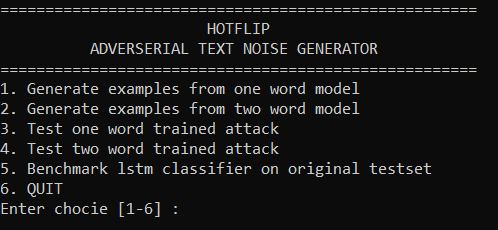

## Word-level Adversarial Examples in Convolutional Neural Networks for Sentence Classification

This repository holds the **Word-level Adversarial Examples** codes and models adapted from the papers 
**HotFlip: White-Box Adversarial Examples for Text Classification**

[[Arxiv Preprint](https://arxiv.org/abs/1712.06751)]
[[ACL 2018](https://www.aclweb.org/anthology/P18-2006)]

## Project Outline
1. #### Purpose
    In the realm of text based training, the use of adversarial examples can greatly benefit the
    improvement of sentiment classifiers. Generating "noise" on a character level is a viable method
    for proofing against common typos and misspellings, however there aren't a lot of viable solutions
    working on word-level problems. **The purpose of this project is to consistently generate semantically
    sound adversarial examples to existing text with the purpose of enriching a given dataset.**
1. #### Pipeline
    This particular project is designed to train on a sentiment classification dataset. This dataset
    is preprocessed using an [associated repository](https://github.com/AnyiRao/SentDataPre). A CNN model
    for adversarial generation is trained on the preprocessed data and another LSTM model is trained for
    ordinary sentiment classification. The model and dataset are then used in a generation script to output
    filtered adversarial examples meeting set prerequisites. These examples are then used for **attacking**
    the LSTM Classifier.
1. #### Inputs
    A list of sentence pairs:<br/>
    * just when the movie seems **confident** enough to handle subtlety , it dives into soapy bathos
    * just when the movie seems **pleased** enough to handle subtlety , it dives into soapy bathos
1. #### Outputs
    A percentage accuracy score on the original dataset spliced with the adversarial examples.

## Environment Requirements
* Python (2.7) 
* Theano (0.9)
* CUDA (9.0)
* Cudnn (8.0)
* NLTK (`stopwords`, `punkt`, `brown`, `wordnet` and `universal_tagset` may require to be downloaded
 from the python interpreter using `nltk.download('package_name')`)
* Pandas
* numpy


*Note: Docker image is still pending on AWS<br/>Warnings are common due to increasing
deprecations and incompatibilities.*

## Deliverables
These include trained models and preprocessing resources:
#### Preprocessing
* Repository with working preprocessing functions [View](https://github.com/JJWasyl/SentDataPre)
* Google word2vec file `SentDataPre\cnn\data` [Download](https://drive.google.com/file/d/1reHfMDtVnGsIzIiSvy8pKv2Jz1WLTl2c/view?usp=sharing)
* Raw SST2 dataset `SentDataPre\cnn\data\sst2` [Download](https://drive.google.com/file/d/1-JIFHI2CYEZBR_mm0CTnSQ6-157CCqwS/view?usp=sharing)
#### Project
* Preprocessed SST2 dataset `WordAdver\ ` [Download](https://drive.google.com/file/d/1604uZ-z5bmy3PhpDNq-tyPU-70NFekqj/view?usp=sharing)
* One_word model `WordAdver\save\one_word` [Download](https://drive.google.com/file/d/1Icp9bxav_4_wmeAoT0f22pgyaSgu1yML/view?usp=sharing)
* Two_word model `WordAdver\save\two_word` [Download](https://drive.google.com/file/d/1hdIJWqCIhX_GPmkJ9ASqziC7lgJSIXTV/view?usp=sharing)
* LSTM model to attack `WordAdver\lstm\data` [Download](https://drive.google.com/file/d/1mvDooe66snP_Pwr_ZW9uJU951Q4ZBLZL/view?usp=sharing)


## Data Preprocessing (optional)
To process the raw data, clone this [repository](https://github.com/JJWasyl/SentDataPre)<br/>
1. Download and place the raw files in the designated directory.
1. Run `SentDataPre\cnn\process_data_sst2`.
1. Run `SentDataPre\lstm\preprocess_sst2`.
1. Import the two `pickle` files to `WordAdver\ ` and `WordAdver\lstm\data` respectively.

## Training
Currently, two model scripts are functional. Please import the preprocessed 
datasets for both models before running any script.<br/>
* ``add_one_word.py`` Only one word flip  
* ``add_two_word.py`` Verify two word flips 
1. Train one of the two above models with a choice of the following parameters and flags.
Change `device=cpu` if you wish to train on the CPU. Use `-nonstatic / -static` for embedding
updates and `-word2vec / -random` for starting word embedding vectors.
1. Similarly, train the LSTM classifier `WordAdver\lstm\sst2_lstm`. You can skip the flags.

*Note: Hyperparameters are edited inside the above script files. Most notable is the
`sim_threshold` for the similarity index and `n_option` for the amount of word options
to examine during training.*

Command examples
```
Multicommand syntax varies slightly between Windows and Unix
THEANO_FLAGS=mode=FAST_RUN,device=cuda,floatX=float32 & python add_one_word.py -nonstatic -rand
THEANO_FLAGS=mode=FAST_RUN,device=cuda,floatX=float32 & python add_one_word.py -static -word2vec
THEANO_FLAGS=mode=FAST_RUN,device=cuda,floatX=float32 & python add_one_word.py -nonstatic -word2vec
```

## Usage
The individual scripts have to be run with the above flags to allow model reloading.
They are accessible individually (note filepaths must then be changes withing the
code if you switch back and forht between models) or through the `adver_api.py` for user convenience. Scripts include:  

* ``use_pretrained_gene_testset.py`` Use pretrained model to generate adversarial test set and test accuracy (with confidence) on it. 
* ``use_pretrained_model.py`` Use adversarial examples from CNN with an adversarial file as the argument.

*Note: the generated examples use `chr201` blankspace characters which confuse the
the classifier and must be cleaned out before use.*

#### Use `adver_api` (reccomended)
 A simplistic menu for generating (and cleaning) adversarial examples and loading them 
 for testing on the LSTM model.  <br/><br/>
 
 <br/> 

### Original Project Citation
If you use this repository in your researh, please cite its original authors:

	@inproceedings{ebrahimi2018hotflip,
	  title={HotFlip: White-Box Adversarial Examples for Text Classification},
	  author={Ebrahimi, Javid and Rao, Anyi and Lowd, Daniel and Dou, Dejing},
	  booktitle={Proceedings of the 56th Annual Meeting of the Association for Computational Linguistics (Volume 2: Short Papers)},
	  pages={31--36},
	  year={2018}
	}
